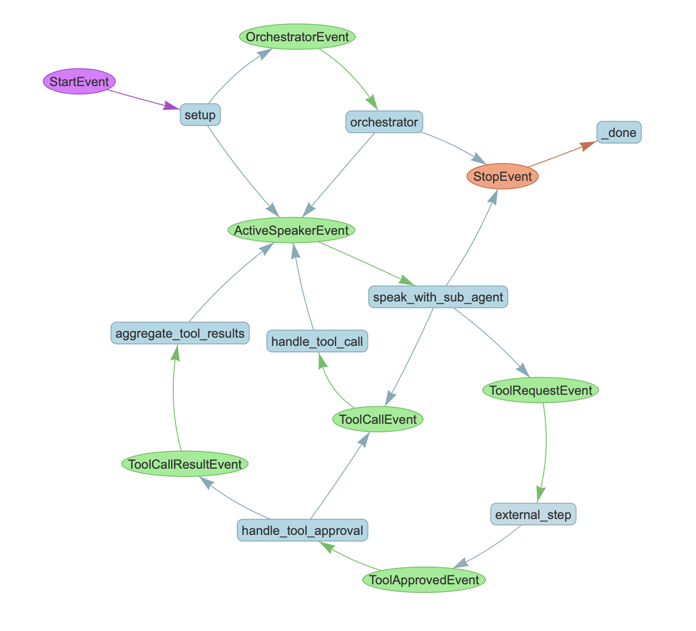
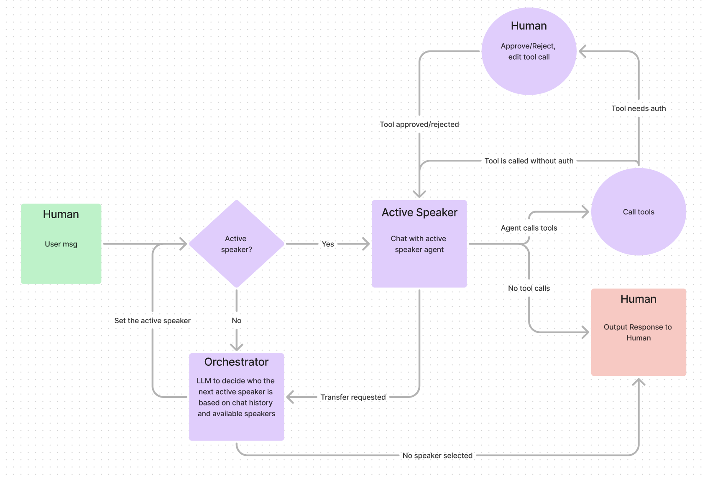

# Multi-agent concierge system

This repo contains two implementations of the multi-agent concierge system described below. The first, `demo.py`, is built using vanilla Python. The second, `workflows.py`, uses LlamaIndex's Workflows abstraction to control flow.

The resulting workflow is rendered automatically using the built-in `draw_all_possible_flows()` and looks like this:



A walkthrough of the Workflows version of this code is available [on YouTube](https://www.youtube.com/watch?v=DqiIDMxuoKA).

## Why build this?

Interactive chat bots are by this point a familiar solution to customer service, and agents are a frequent component of chat bot implementations. They provide memory, introspection, tool use and other features necessary for a competent bot.

We have become interested in larger-scale chatbots: ones that can complete dozens of tasks, some of which have dependencies on each other, using hundreds of tools. What would that agent look like? It would have an enormous system prompt and a huge number of tools to choose from, which can be confusing for an agent.

Imagine a bank implementing a system that can:
* Look up the price of a specific stock
* Authenticate a user
* Check your account balance
    * Which requires the user be authenticated
* Transfer money between accounts
    * Which requires the user be authenticated
    * And also that the user checks their account balance first

Each of these top-level tasks has sub-tasks, for instance:
* The stock price lookup might need to look up the stock symbol first
* The user authentication would need to gather a username and a password
* The account balance would need to know which of the user's accounts to check

Coming up with a single primary prompt for all of these tasks and sub-tasks would be very complex. So instead, we designed a multi-agent system with agents responsible for each top-level task, plus a "concierge" agent that can direct the user to the correct agent.

## What we built

We built a system of agents to complete the above tasks. There are four basic "task" agents:
* A stock lookup agent (which takes care of sub-tasks like looking up symbols)
* An authentication agent (which asks for username and password)
* An account balance agent (which takes care of sub-tasks like selecting an account)
* A money transfer agent (which takes care of tasks like asking what account to transfer to, and how much)

There are also three "meta" agents:

1. A **concierge agent**: this agent is responsible for interacting with the user when they first arrive, letting them know what sort of tasks are available, and providing feedback when tasks are complete.

2. An **orchestration agent**: this agent never provides output directly to the user. Instead, it looks at what the user is currently trying to accomplish, and responds with the plain-text name of the agent that should handle the task. The code then routes to that agent.

3. A **continuation agent**: it's sometimes necessary to chain agents together to complete a task. For instance, to check your account balance, you need to be authenticated first. The authentication agent doesn't know if you were simply trying to authenticate yourself or if it's part of a chain, and it doesn't need to. When the authentication agent completes, the continuation agent checks chat history to see what the original task was, and if there's more to do, it formulates a new request to the orchestration agent to get you there without further user input.

A **global state** keeps track of the user and their current state, shared between all the agents.

The flow of the the system looks something like this:



## The system in action

To get a sense of how this works in practice, here's sample output including helpful debug statements. Output that would be ordinarily shown to the user is <span style="color:magenta">magenta</span>, and user input is shown `as fixed text`.

At the beginning of the conversation nothing's happened yet, so you get routed to the concierge:

<blockquote>
No current speaker, asking orchestration agent to decide

Concierge agent selected

<span style="color:magenta">Hi there! How can I assist you today? Here are some things I can help you with:</span>
- <span style="color:magenta">Looking up a stock price</span>
- <span style="color:magenta">Authenticating you</span>
- <span style="color:magenta">Checking an account balance (requires authentication first)</span>
- <span style="color:magenta">Transferring money between accounts (requires authentication and checking an account balance first)</span>

<span style="color:magenta">What would you like to do?</span>
```
> Transfer money
```
</blockquote>

The "transfer money" task requires authentication. The orchestration agent checks if you're authenticated while deciding how to route you (it does this twice for some reason, it's a demo!):

<blockquote>
No current speaker, asking orchestration agent to decide

Orchestrator is checking if authenticated

Orchestrator is checking if authenticated

Auth agent selected
</blockquote>

It correctly determines you're not authenticated, so it routes you to the authentication agent:

<blockquote>
<span style="color:magenta">To transfer money, I need to authenticate you first. Could you please provide your username and password?</span>

```
> seldo
```
</blockquote>

This is a fun part: you've provided input, but it's not sufficient to complete the task (you didn't give a password). So when the flow goes back to the orchestration agent, the global state indicates that the "authenticate" agent is already running and hasn't completed yet, so it routes back to the authentication agent, and does that again for the password:

<blockquote>
There's already a speaker: authenticate

Auth agent selected

Recording username

<span style="color:magenta">Thank you! Now, could you please provide your password?</span>

```
> monkey
```

There's already a speaker: authenticate

Auth agent selected

Logging in seldo

Checking if authenticated

Authentication is complete
</blockquote>

Now the auth agent has called a `done()` function that indicates to the global state that it has completed its task. So the flow now goes to the continuation agent, which looks at the chat history and sees that the user was trying to transfer money. So it generates a prompt, as if spoken by the user, and sends that to the orchestration agent:

<blockquote>
<span style="color:magenta">You have been successfully authenticated. Another agent will assist you with transferring money.</span>

Asking the continuation agent to decide what to do next

Continuation agent said "I would like to transfer money."

No current speaker, asking orchestration agent to decide

Orchestrator checking if account has a balance

Orchestrator checking if account has a balance

Account balance agent selected
</blockquote>

Now you're authenticated, but you haven't checked your balance yet, which the orchestration agent knows is necessary for transferring money. So it routes you to the account balance agent (after checking twice for some reason):

<blockquote>

<span style="color:magenta">Before you can transfer money, you need to check your account balance. Let's start by looking up your account balance. Could you please provide the name of the account you're interested in?</span>

```
> Checking
```

There's already a speaker: account_balance

Account balance agent selected

Looking up account ID for Checking

Looking up account balance for 1234567890

Account balance lookup is complete

<span style="color:magenta">Your Checking account has a balance of $1000. Another agent will assist you with transferring money.</span>

Asking the continuation agent to decide what to do next

Continuation agent said "I would like to transfer money."

No current speaker, asking orchestration agent to decide

Transfer money agent selected
</blockquote>

The account balance agent asks you which account, uses a tool to get the ID for that account, and then marks itself as done. The continuation agent kicks in again and sees that you still haven't completed your original task of transferring money, so it prompts the orchestrator agent again. Unfortunately the orchestrator gets a little confused, and loops twice before finally routing you to the transfer money agent:

<blockquote>
Money transfer is complete

<span style="color:magenta">Another agent will assist you with transferring money.</span>

Asking the continuation agent to decide what to do next

Continuation agent said "I would like to transfer money."

No current speaker, asking orchestration agent to decide

Transfer money agent selected

Money transfer is complete

<span style="color:magenta">Another agent will assist you with transferring money.</span>

Asking the continuation agent to decide what to do next

Continuation agent said "I would like to transfer money."

No current speaker, asking orchestration agent to decide

Orchestrator checking if account has a balance

Transfer money agent selected

<span style="color:magenta">You have already checked your account balance. Please provide the following details to proceed with the money transfer:</span>

<span style="color:magenta">1. The account ID to which you want to transfer the money.</span>

<span style="color:magenta">2. The amount you want to transfer.</span>

```
> To account ID 1234324
```

There's already a speaker: transfer_money

Transfer money agent selected

How much would you like to transfer to account ID 1234324?

```
> 500
```

There's already a speaker: transfer_money

Transfer money agent selected

Checking if balance is sufficient

Transferring 500 from 1234567890 account 1234324

Money transfer is complete

<span style="color:magenta">The transfer of $500 to account ID 1234324 has been successfully completed. If you need any further assistance, feel free to ask!<span style="color:magenta">

Asking the continuation agent to decide what to do next

Continuation agent said no_further_tasks
</blockquote>

We've reached the end of the task! The continuation agent sees that there are no further tasks, and routes you back to the concierge.

## What's next

We think there's some novel stuff in here: coordinating multiple agents "speaking" simultaneously, creating implicit "chains" of agents through natural language instructions, using a "continuation" agent to manage those chains, and using a global state this way. We're excited to see what you do with the patterns we've laid out here.
